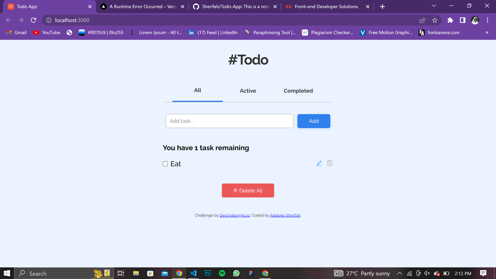

<!-- Please update value in the {}  -->

<h1 align="center">Todo App</h1>

<div align="center">
   Solution for a challenge from  <a href="http://devchallenges.io" target="_blank">Devchallenges.io</a>.
</div>

<div align="center">
  <h3>
    <a href="https://todo-app-two-murex.vercel.app/">
      Demo
    </a>
    <span> | </span>
    <a href="https://devchallenges.io/solutions/lrmdYC3numAQH8fWix4C">
      Solution
    </a>
    <span> | </span>
    <a href="https://devchallenges.io/challenges/hH6PbOHBdPm6otzw2De5">
      Challenge
    </a>
  </h3>
</div>

<!-- TABLE OF CONTENTS -->

## Table of Contents

- [Overview](#overview)
  - [Built With](#built-with)
- [Features](#features)
- [How to use](#how-to-use)
- [Contact](#contact)
- [Acknowledgements](#acknowledgements)

<!-- OVERVIEW -->

## Overview

![screenshot]

  <div>
    This is a note-taking application built using React.js. The app allows users to create, edit, and delete notes. Notes can be saved and loaded from the browser's local storage.
  </div>

  <div>The app demo can be found here <a href="https://todo-app-two-murex.vercel.app/">Note App Demo</a>. It was really fun and just a little challenging working on my first React project. As a designer myself, I had to make sure that the app interface is as pixel-perfect as possible. The responsive on mobile, tablet as well as desktop was a bit tasking too but it was a great chance to practice my CSS :).</div>

### Built With

- [React](https://reactjs.org/)
- [HTML & CSS]

## Features

<!-- List the features of your application or follow the template. Don't share the figma file here :) -->

This application/site was created as a submission to a [DevChallenges](https://devchallenges.io/challenges) challenge. The [challenge](https://devchallenges.io/challenges/hH6PbOHBdPm6otzw2De5) was to build an application to complete the given user stories which are: 

- [Create new notes]
- [Edit existing notes]
- [Delete notes]
- [Save notes to local storage]
- [Load notes from local storage]

## How To Use

<!-- Example: -->

To clone and run this application, you'll need [Git](https://git-scm.com) and [Node.js](https://nodejs.org/en/download/) (which comes with [npm](http://npmjs.com)) installed on your computer. From your command line:

```bash
# Clone this repository
$ git clone https://github.com/your-user-name/your-project-name

# Install dependencies
$ npm install

# Run the app
$ npm start
```

## Acknowledgements

- [This project was built as a learning exercise for React.js.]
- [Thanks to Create React App for providing a great starting point for the project.]

## Contact

- GitHub [@Sherifah](https://github.com/Sherifah)
- Twitter [@adelekesherifah](https://twitter.com/adelekesherifah)
